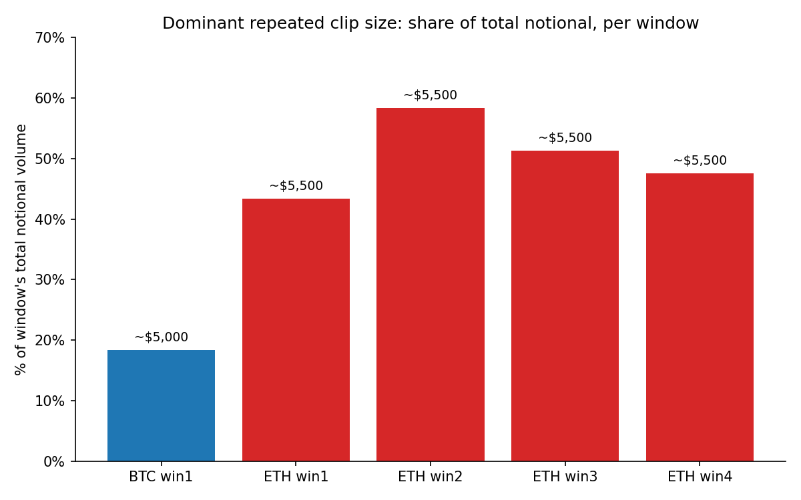
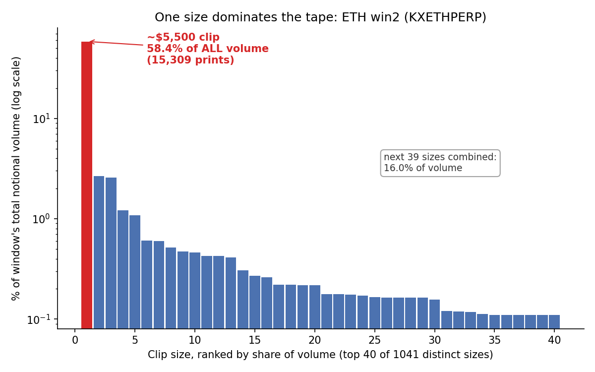

# kalshi-clip-anomaly

A tool for detecting trade-size concentration on Kalshi's perpetual futures
markets (PERPs). It pulls the public trade tape for a market and checks
whether a small number of identical notional trade sizes ("clips") account
for a disproportionate share of total volume, a pattern that can indicate
algorithmic market-making with a fixed lot size, or, at the more extreme
end, artificially inflated volume.

This kind of volume-to-open-interest and clip-size scrutiny has been part
of a broader public discussion around crypto perpetuals volume reporting in
2026. This repo provides an independent, reproducible way to pull the
numbers yourself from Kalshi's public API and check them.

⚠️ **This is a descriptive/statistical tool, not a verdict.** A high
concentration on one clip size, even with a high burst rate, is not proof of
wash trading by itself. It can also arise from legitimate algorithmic
market-making with a fixed dollar target. The script reports the numbers;
interpreting them is up to you.

## What's in here

- **`kalshi_clip_anomaly.py`**: self-contained Python script. Pulls trades
  from Kalshi's **public** Perps trade endpoint (no API key needed), computes
  per-window clip-size concentration plus a "loop%" burst heuristic, and
  writes a Markdown report.
- **`data/`**: output of a run against five specific ETH-PERP / BTC-PERP
  windows in September 2026 (raw trade CSVs, per-window JSON summaries, and
  the combined `report.md`), archived on 2026-09-21.
- **`windows_example.json`**: example window-list file (the same windows
  used to produce `data/report.md`), showing the input format for `--windows`.
- **`dominant_clip_share.png`** and **`notional_distribution.png`**: the two
  summary charts embedded below.

## Visual overview

**1. Dominant clip's share of total notional volume, per window**



Each bar is one analyzed window. The height is the share of that window's
total dollar volume made up by a single repeated trade size (banded to
merge near-duplicate clips caused by price drift, see Methodology below).
On ETH-PERP this single size accounts for 43-58% of all volume in every
window checked.

**2. Notional-size distribution for one window, with the dominant clip highlighted**



This is the full distribution of individual trade sizes (by dollar
notional) for ETH win2, the most concentrated window. Almost all trades
cluster into a handful of round/small sizes, except for one massive,
narrow spike around $5,500, the clip in question, which dwarfs every other
size on the tape.

## Results summary (from `data/report.md`)

| window | ticker | duration | total notional | dominant clip (banded) | % of notional | loop % |
|---|---|---|---|---|---|---|
| ETH win1 | KXETHPERP | 5.52h | $130.5M | ~$5,500 | 43.5% | 90.99 |
| ETH win2 | KXETHPERP | 8.90h | $144.1M | ~$5,500 | 58.4% | 91.54 |
| ETH win3 | KXETHPERP | 16.82h | $108.2M | ~$5,500 | 51.4% | 79.68 |
| ETH win4 | KXETHPERP | 16.92h | $119.5M | ~$5,500 | 47.6% | 77.68 |
| BTC win1 | KXBTCPERP | 6.90h | $75.3M | ~$5,000 + ~$2,500 (two sizes) | 35.1% combined | 86.69 / 65-90 |

See `data/report.md` for the full per-window breakdown (exact-dollar table
plus banded table, top 15/10 rows).

## Methodology notes

1. **Notional formula.** Kalshi's `price` field returned by the trades
   endpoint is *already* the dollar price of one contract (it bakes in
   `contract_size`). Verified empirically:
   `open_interest_notional_value_dollars == open_interest * price` exactly,
   for every market checked. So:

   ```
   notional_per_trade = count * price      # correct
   notional_per_trade = count * price * contract_size   # WRONG, double counts
   ```

2. **Clip fragmentation from price drift.** A trader/algo targeting a fixed
   *dollar* notional (e.g. ~$5,500) will produce a slightly different exact
   integer clip on every trade as the spot price ticks (e.g. 5497, 5498,
   5499, 5500, 5501: same logical clip). Rounding to the nearest dollar
   under-counts the concentration. The script reports **both**:
   - an exact-dollar table (`clip_$`), and
   - a banded table (`--band-width`, default $20) that merges near-duplicate
     clips: this is the number to look at for the true concentration.

3. **`loop%` is a heuristic, not a standard.** There is no official
   definition. Here: for a given clip-size group, a print counts as
   "looped" if another print of the *same* clip occurred within
   `--loop-gap-sec` seconds (default 5s) before or after it. Test
   sensitivity by varying `--loop-gap-sec`.

## Usage

```bash
pip install -r requirements.txt

# Full run against the built-in default windows (re-fetches from the API)
python3 kalshi_clip_anomaly.py --outdir ./out

# Re-analyze already-downloaded data with different parameters
# (no network calls, fast iteration)
python3 kalshi_clip_anomaly.py --outdir ./out --reanalyze-only \
    --loop-gap-sec 10 --band-width 50

# Your own windows / tickers
python3 kalshi_clip_anomaly.py --windows windows_example.json --outdir ./out

# Regenerate the two charts above from a run's output
python3 make_charts.py --outdir ./out --charts-dir .
```

Key flags:

| flag | default | meaning |
|---|---|---|
| `--windows PATH` | built-in windows | JSON file: list of `{ticker, start, end, label}` |
| `--outdir DIR` | `./kalshi_clip_out` | where raw CSVs / summaries / report.md go |
| `--loop-gap-sec N` | 5 | max gap (s) between same-size prints to count as "looped" |
| `--band-width N` | 20 | $ width for the clustered/banded clip table |
| `--page-limit N` | 1000 | trades per API page (max 1000) |
| `--reanalyze-only` | off | skip the API, recompute from cached `raw_*.csv` in `--outdir` |

## Data source & access notes

- Endpoint: `GET https://external-api.kalshi.com/trade-api/v2/margin/trades`.
  Public, no authentication required (confirmed against the live OpenAPI
  spec: `security: []`).
- Also public/unauthenticated: `/margin/markets`, `/margin/risk_parameters`,
  `/margin/exchange/status` (used to get `contract_size` / tickers, not
  required for the trade-tape analysis itself).
- Real tickers are `KXETHPERP` / `KXBTCPERP` (not `ETH-PERP` / `BTC-PERP`).
- No documented public rate limit for this endpoint as of Sept 2026; the
  script backs off and retries on 429/5xx automatically.
- Perps (margin) trading launched on Kalshi in late May 2026, so historical
  depth only goes back that far.

## License

MIT. See `LICENSE`.
